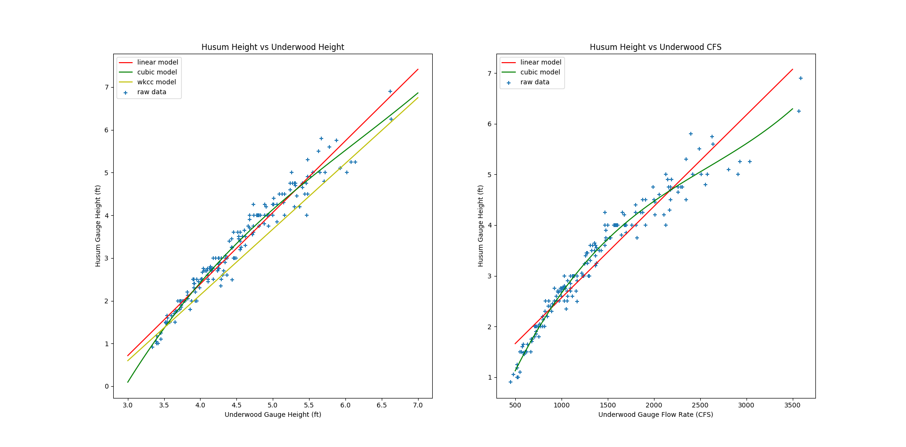

# How does the Husum gauge relate to Underwood?

I wanted to see how readings at the Husum gauge relate to the continuously reported USGS gauge at Underwood. Could the Underwood height or flow tell me something useful about the level on the Husum stick?

This project explores that relationship using historical Husum readings paired with USGS observations. I compared simple linear fits with cubic fits, and kept the data and plotting code so the relationship can be inspected rather than reduced to a single conversion number.

## Putting the readings together

The [collection script](analysis/scrape_facebook.py) extracts reported heights from posts on the `whitesalmonriverathusum` Facebook page. It then queries USGS station **14123500** for gauge height and discharge around each post's timestamp.

The resulting [CSV](analysis/gauge_data.csv) contains 177 paired records, dated November 18, 2015 through September 26, 2020:

| Measurement | Column | Observed range |
|---|---|---|
| Reported Husum height | `husum_ft` | 0.91–6.90 ft |
| Underwood gauge height | `usgs_ft` | 3.34–6.63 ft |
| Underwood discharge | `usgs_cfs` | 452–3,590 cubic feet per second |

These are the ranges in the saved dataset, not the limits of either gauge or a claim about today's conditions.

The matching is approximate. The script requests a six-hour window beginning at the post time and takes the first returned value for each USGS series. A post timestamp need not be the time the Husum reading was taken, and the two locations need not respond simultaneously. The text parser also uses heuristics to interpret feet and decimal values. Those details matter when interpreting the scatter.

## Comparing the relationships

The [analysis script](analysis/plot_gauge_data.py) fits Husum height as a function of two different measurements: Underwood height and Underwood discharge. For each, it compares a straight line with a third-degree polynomial.



On the left, the height-to-height relationship is fairly close to a straight line through much of the observed range. On the right, the discharge-to-height relationship shows more curvature; the cubic fit follows that shape more closely in parts of the plot. The points still have visible scatter, especially at higher readings.

The left panel also includes the comparison line labeled `wkcc model` in the original script:

```text
Husum height (ft) = -4.020 + 1.539 × Underwood height (ft)
```

I have kept that comparison as it appears in the original analysis. This repository does not document its original derivation, so I would not treat the label as an independently verified calibration.

## What I take from the plot

The historical readings show a useful relationship between the gauges. They also show why a conversion should carry uncertainty: the same Underwood reading can correspond to different reported Husum levels.

The existing script fits and plots the same dataset. It does not report held-out prediction errors or confidence intervals, so a curve that follows these points more closely is not yet evidence that it will predict new readings better. Cubic extrapolation beyond the observed range is also a different question from fitting the measurements we have.

If I revisit the project, I would start by checking the timestamp matching, reviewing unusual or repeated observations, and testing predictions on observations from a later period. That would help answer the practical question: how much uncertainty should accompany an estimated Husum reading?

This page describes a historical analysis. It does not display current river levels.

## Data and code

- [Paired readings](analysis/gauge_data.csv)
- [Historical collection script](analysis/scrape_facebook.py)
- [Regression and plotting script](analysis/plot_gauge_data.py)
- [Original regression figure](analysis/husum_regression.png)

The plotting script uses pandas, NumPy, Matplotlib and scikit-learn. It expects to run from the `analysis` directory. Its `sklearn.externals.joblib` import is historical and needs updating to standalone `joblib` for current scikit-learn versions. The collection script likewise contains a local Facebook-scraper path and depends on historical service behavior. The saved CSV and figure can be reviewed without rerunning collection.

The original data, scripts and figure are unchanged in this documentation update. This write-up was prepared with Codex from the repository contents. Code is licensed under [GPLv3](LICENSE).
